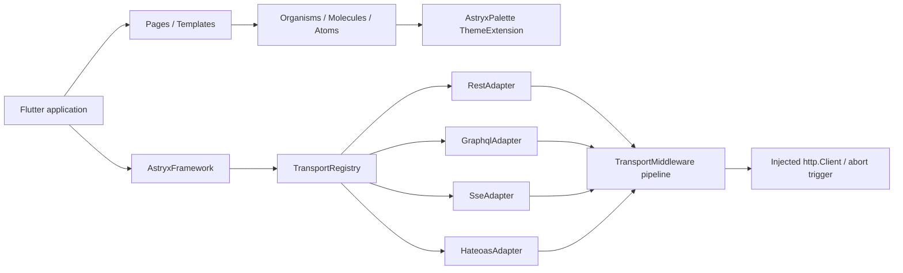

# Architecture

`astryx_flutter` has two independent axes: visual composition and transport
capabilities. The package root exports both, while applications keep ownership
of state management, caching, domain models, and navigation.

## Visual axis

- **Tokens** are immutable Flutter colors, radii, and durations.
- **Theme** bridges tokens into Material 3 without hiding the raw
  `AstryxPalette` extension.
- **Atoms** own one semantic responsibility.
- **Molecules** combine atoms into a small piece of product meaning.
- **Organisms** arrange molecules and react to available width.
- **Templates** own layout and navigation slots.
- **Pages** bind real registry state to templates and organisms.

The public API exports all levels so consumers are not forced to adopt the
showcase page or dashboard navigation.

## Transport axis

Every adapter declares a protocol and a set of capabilities:

| Adapter | request/response | streaming | hypermedia |
| --- | ---: | ---: | ---: |
| `RestAdapter` | yes | no | no |
| `GraphqlAdapter` | yes | no | no |
| `SseAdapter` | no | yes | no |
| `HateoasAdapter` | yes | no | yes |

This avoids pretending that an infinite event stream behaves like an HTTP
response or that HATEOAS is a wire protocol separate from HTTP. The registry
provides discovery and routing; protocol-specific adapters keep their native
APIs.

Each built-in adapter owns a middleware pipeline. A shared middleware list can
therefore add authentication context, correlation IDs, metrics, or request
policy once while the terminal adapter still owns GraphQL envelopes, SSE
streams, and hypermedia relations. `TransportRequest.abortTrigger` follows the
request through that same chain to an abort-capable HTTP client.

## Extension points

- Construct adapters with an external `http.Client` for retries, tracing,
  native networking, testing, or certificate policy.
- Use `headerProvider` for short-lived authentication headers.
- Use `TransportMiddleware` for behavior that must compose across protocols.
- Complete `abortTrigger` when an application lifecycle event should stop work.
- Subclass `TransportAdapter` and register a replacement with
  `register(adapter, replace: true)`.
- Build domain repositories above the adapters; widgets should consume domain
  state rather than raw transport responses in production applications.
