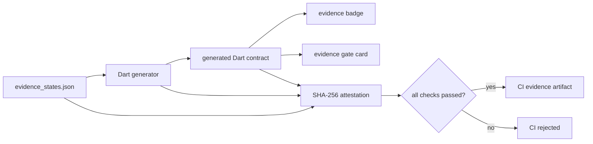

# Evidence metaprogramming

Astryx keeps evidence-state policy in
`meta/evidence_states.json`. The JSON is the reviewable source; generated Dart
is a compiled artifact used by widgets and downstream applications.



## Invariant

Only the generated `passed` state may set `permits_open_loop` to `true`.
Widgets therefore cannot reinterpret a pending, blocked, expired, or
contradicted decision as permission. Product applications still decide which
specific steps were declared; Astryx only renders that boundary.

## Generate and check

```sh
dart run tool/generate_evidence_contract.dart
dart run tool/generate_evidence_contract.dart \
  --check \
  --evidence build/evidence/metaprogramming.json
```

The generator and SHA-256 implementation use the Dart SDK only. Check mode
compares the complete expected output with the checked-in generated file and
fails on any drift.

## CI evidence

Every public CI run records the outcome of dependency installation,
metaprogramming, formatting, analysis, package tests, example tests,
publication validation, and the release web build. `tool/attest_ci.dart` binds
those outcomes to hashes of the source, generator, generated Dart, widgets,
tests, workflow, and package manifest.

`tool/check_attestation.dart` recomputes every artifact hash and releases the
CI gate only when the recorded decision is `passed`. The JSON files are
uploaded as a hash-addressed workflow artifact; they contain no account,
credential, content, revenue, or raw evidence data.
